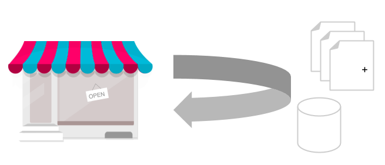

# Keep PrestaShop up-to-date

## Introduction

The purpose of this chapter is to provide the best practices and tips for keeping your PrestaShop up-to-date. Its compatibility range should cover at least shops running on versions 1.7 through 8.

Keeping a shop updated to the latest available version ensures you have the latest changes brought by the core team and the developer community.
Depending on the version you upgrade to, you can get new features, security or performance improvements, or simply bug fixes.

## Upgrade and migration, two different processes

Keeping PrestaShop up-to-date can be done via different methods. Choose the best update method depending on your needs.

### In-place Upgrade

Upgrading a shop is the recommended method when you want to get your shop up-to-date without switching to the next major version.

It does not require any additional tools to run if you follow the manual process, the most recent release package will be enough.

#### Impact on existing data

As long as you stay on the same major version (ex. 1.7.1 >> 1.7.2, 8.0 >> 8.1 upgrade), we make sure that the available features remain the same.
This means that your current theme and all your modules should continue to work as before, and no functionality or data will be lost during the upgrade, even if the database structure may change.

This can be explained by the [semantic versioning](https://semver.org/) we follow, that forbids any compatibility-breaking change in the core, such as removing a feature or modifying our APIs in versions other than major.

Note that once an upgrade has started, there is no way to rollback the changes. The only solution you have is restoring the backup you made before.

#### Process summary

- Prepare your upgrade by getting the latest release zip file, unpacking it and removing its demo content.
- Apply the new files by copy-pasting them in the production folder.
- Run the database upgrade.

This could be enough for completing an upgrade, but additional tasks like cleanup and modules upgrade will bring you stability and security. This is how the `autoupgrade` module works.

### Migration

Upgrading is not the only way to get your shop to the latest version of PrestaShop. In some cases, migrating your data is a better option.

This option is recommended when you switch on a new major version. As it brings a lot of changes in the core with many potential incompatibilities with the current theme and modules, starting fresh is less risky for stability.

_“Migrating” means moving your current shop to a new shop which is already running on the latest version in parallel._

It implies creating a new shop and transferring your existing data (like products, customers, orders...) into it, and disable your old shop afterwards.

The main advantage of this option is it does not require the shop in production to be in maintenance mode. As long as you feel your new shop is not ready, you can keep the previous one running for your customers.

#### Impact on existing data

The impact on the existing data is very different from an upgrade, as it depends on what you transfer to the new shop.

When switching to another major version (i.e 1.7.x >> 8.x), this will imply that some resources will be lost:

* **Permissions**

On PrestaShop, the whole permissions system has been reworked to fit with Symfony. We recommend to recreate your employees, access groups and their permissions instead of migrating them.

* **Theme**

The theme system has been overhauled in 1.7, so 1.6 themes won't work anymore.
The controllers have changed, and the data shared between them and the views has also evolved.

* Modules not compatible with the new version

Modules can be more resilient to PrestaShop new releases, but some incompatibilities may occur when using another major version.
For modules downloaded from the marketplace, you can check their compatibility range.
For home-made modules, contact your developer to check its compatibility, but as a general rule consider them incompatible until proven otherwise.

Each module reinstalled on the new shop will need to be reconfigured.

### Process details

A migration consists in:

1. Setting up a new shop running on the latest version
2. Getting the production content from old shop
3. Modifying the content for compatibility requirements, necessary data update
4. Importing the data in the new shop

## Read more

{}

