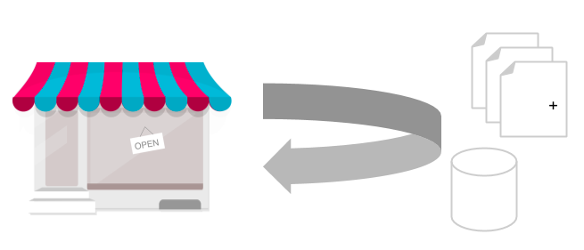

# Keep PrestaShop up-to-date

## Introduction

This section provides best practices and tips for maintaining your PrestaShop store with the latest updates. Here, we explore various methods to keep your store current and secure.

## Why keeping your PrestaShop store up-to-date ?

Regularly updating your store to the latest available version ensures that you benefit from the newest features and improvements from the core team and the developer community. Depending on the version you choose, updates bring a variety of advantages:

- **New Features:** Access the latest features and enhancements for an improved experience.
- **Design & UX Improvements:** Enjoy updated themes and modernized user interfaces.
- **Security Enhancements:** Protect your store with the latest security patches and performance updates.
- **Technical Compatibility:** Ensure compatibility with the latest technologies and updates.
- **Ecosystem Growth:** Take advantage of new modules, themes, and their ongoing updates.
- **Stability & Reliability:** Benefit from bug fixes and patches that enhance the stability of your store.
- **Official Support:** Stay within the scope of officially supported PrestaShop versions and services.

## Update vs Migration: two distinct processes

Keeping PrestaShop up-to-date can be achieved through different methods. Choose the most suitable update process based on your specific needs.

### Updating PrestaShop

Updating your store is the recommended approach when you want to stay up to date without switching to the next major version.

#### Impact on existing data

As long as you remain within the same major version (e.g., 8.0 → 8.1, 9.0 → 9.1), PrestaShop ensures that all existing features remain intact. This means:

- Your current theme and modules will continue to function as expected.
- No data or functionalities will be lost, even if database structures are modified.

This stability is guaranteed by the <a href="https://semver.org/" target="_blank">semantic versioning</a> system we follow, which prevents any compatibility-breaking changes in minor and patch updates. Core features, APIs, and functionality remain unchanged outside of major releases.

#### Update process overview

1. **Download** the Update Assistant module, designed specifically for PrestaShop updates.
2. **Run the update** via the module’s web interface or using the Command-Line Interface (CLI).
3. **Enjoy your updated store** with the latest improvements and fixes.

For a detailed step-by-step guide, refer to the official documentation for the [Update Assistant module][1].

### Migrating PrestaShop

Updating isn’t the only way to bring your store to the latest version of PrestaShop. In some cases, migrating your data is a better option.

Migration is recommended when switching to a new major version. Since major updates introduce significant core changes and potential incompatibilities with your current theme and modules, starting fresh ensures greater stability and reduces risks.

> Migration means transferring your existing store’s data to a newly installed store running the latest version.

This process involves:

- Setting up a new store.
- Transferring essential data (products, customers, orders, etc.).
- Deactivating the old store once the migration is complete.

#### Impact of migration on existing data

Unlike an update, migration does not retain all data automatically. Some elements may need to be manually recreated or adapted:

- **Permissions**

PrestaShop’s permission system has been redesigned with Symfony. Instead of migrating user roles, it is recommended to manually recreate employee accounts, access groups, and permissions in the new store.

- **Theme**

If you are updating from PrestaShop 1.6, your theme will not be compatible with 1.7 and later versions. The theme system, controllers, and data structures have changed significantly. You will need to install a compatible theme for the new version.

- **Modules Compatibility**

While some modules are resilient to PrestaShop updates, others may be incompatible when switching to a new major version.

-&nbsp;For marketplace modules, check the compatibility range before reinstalling them.

-&nbsp;For custom-built modules, consult your developer to verify compatibility. As a rule of thumb, assume modules are incompatible until proven otherwise.

All reinstalled modules must be manually reconfigured on the new store.

#### Migration process overview

A successful migration follows these steps:

1. **Set up** a new store running the latest PrestaShop version.
2. **Extract** production data from the old store.
3. **Adapt** the data to meet compatibility requirements.
4. **Import** the data into the new store.

For a detailed step-by-step guide, refer to the Migration Documentation (link to migration page).

## Read more

- 
- 
- 

[1]: 
