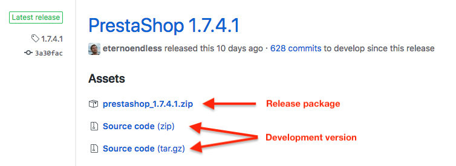

# Installing PrestaShop for development

Now that you intend to develop for PrestaShop, you are better off keeping all your development work on your machine. The main advantage is that it makes it possible for you to entirely bypass the process of uploading your file on your online server in order to test it. Another advantage is that a local test environment enables you to test code without the risk of breaking your production store. Have a local environment is the essential first step in the path of web development.

## Prerequisites

Read [System Requirements][system-requirements].

## Installing a local environment

Installing any web-application locally requires that you first install the adequate environment, namely the Apache web server, the PHP language interpreter, the MySQL database server, and ideally the phpMyAdmin tool. This is called an *AMP package: Apache+MySQL+PHP and the operating system, giving WAMP (Windows+Apache+MySQL+PHP), MAMP (Mac OS X+…) and LAMP (Linux+…). Since all of the items packaged are open-source, these installers are most of the time free.

Here is a selection of free AMP installers:

* [XAMPP](https://www.apachefriends.org/en/xampp.html) (Windows, Mac OS X, Linux, Solaris)
* [WampServer](http://www.wampserver.com/) (Windows)
* [EasyPHP](https://www.easyphp.org/) (Windows)
* [MAMP](https://www.mamp.info/) (Mac OS X)


## Creating a database for your local shop

Open the phpMyAdmin tool using your browser. Its location depends on the AMP pack you chose:

* http://127.0.0.1/phpmyadmin (XAMPP, WampServer, MAMP),
* http://127.0.0.1/mysql (EasyPHP)

In the “Databases” tab, indicate the database name you want and validate by clicking on the “Create a database” button.

## Downloading PrestaShop

The source code of PrestaShop is hosted on the [Official PrestaShop GitHub Repository](https://github.com/PrestaShop/PrestaShop/).

You can find all the released versions of PrestaShop here: [PrestaShop releases](https://github.com/PrestaShop/PrestaShop/releases).

Nightly releases of PrestaShop are also generated daily. Their details can be found on a [public Google Cloud storage](https://console.cloud.google.com/storage/browser/prestashop-core-nightly).

### Choosing the right version for you

PrestaShop comes in two "flavors":

- **Release package**. A zip package, tuned for production environments.
- **Development version**. The raw source code as it is on the GitHub repository, including automated test suites, build scripts and source codes for assets that are otherwise compiled (like javascript and css files).



{}
**Prefer cloning the repository using git for the development version.**

If you intend to work on PrestaShop itself, we suggest using Git to clone the source code of PrestaShop from the GitHub repository.
{}

{}

#### Repository branches

As stated above, if you decide to work on PrestaShop itself, it's best to clone the PrestaShop repository and work using git. Depending on the version of PrestaShop you want to work on, you will need to choose the right branch:

* The [develop branch](https://github.com/PrestaShop/PrestaShop/tree/develop) contains the current work in progress for the next minor or major version.
    - **This is the right branch to contribute new features, refactors, small bug fixes, etc.**
* The maintenance branches (_1.6.1.x, 1.7.0.x, 1.7.1.x, 1.7.2.x, ..._) contains all patches made for each minor version.
    - For example, the _1.7.2.x_ branch contains all patches from 1.7.2.0 to 1.7.2.5.
    - Whenever a new minor or major version is ready for release, a new maintenance branch is created. For example, _1.7.0.x_ for version 1.7.0.0, _1.7.1.x_ for 1.7.0.0, _1.7.2.x_ for 1.7.2.0, and so forth.
    - **Only the most recent maintenance branch accepts new contributions** (except [1.6.1.x](https://github.com/PrestaShop/PrestaShop/tree/1.6.1.x) which is in extended maintenance)
    
{}

Clone the repository using Git or extract the zip package in a `prestashop` folder inside the document folder of the AMP installer you chose:

* XAMPP: `C:\xampp\htdocs` or `/Applications/xampp/htdocs`
* WampServer: `C:\wamp\www`
* EasyPHP: `C:\easyphp\www`
* MAMP: `/Applications/MAMP/htdocs/`

## Download dependencies using composer

{}
This step is only needed if you downloaded the development version.
{}

Use [composer](https://getcomposer.org/download/) to download the project's dependencies:

```bash
$ cd /path/to/prestashop
$ composer install
```

## Setting up file rights

PrestaShop needs recursive write permissions on several directories:

- ./admin-dev/autoupgrade
- ./app/config
- ./app/logs
- ./app/Resources/translations
- ./cache
- ./config
- ./download
- ./img
- ./log
- ./mails
- ./modules
- ./themes
- ./translations
- ./upload
- ./var

You can setup proper permissions with that one line:
```bash
$ chmod +w -R admin-dev/autoupgrade app/logs app/Resources/translations cache config/themes download img log mails modules themes translations var
```

If you don't have any of above folder, plase create it before change permissions. For example:
```bash
$ sudo mkdir log app/logs
```

To ease up your life on a development environment, we suggest to either:

- Make Apache run with your own user.
- Add your own user and Apache's to a common user group (eg. "_www"), then `chown` all PrestaShop files to "youruser:_www". 

{}
<b>Never do that in production!</b> Carefully change permissions folder by folder instead.
{}

## Installing PrestaShop

Open the PrestaShop installer and follow its instructions.

Depending on whether you downloaded a release package or cloned the repository, the route to the installer will be slightly different:

- Release package: http://127.0.0.1/prestashop/install
- Development version: http://127.0.0.1/prestashop/install-dev

You can read the [Getting Started guide][getting-started-guide] for more details.

## Troubleshooting

#####  Compile Error: Cannot declare class AppKernel, because the name is already in use

You may find this error message the first time you open up the Back Office.

This problem may arise in case-insensitive file systems like MacOS due to a misconfiguration. Check your Apache configuration and make sure that the root directory path to your PrestaShop matches the capitalization of the actual system path exactly. A typical error is for example having a folder named `/path/to/PrestaShop` (capital P, capital S) and then configuring it in Apache as `/path/to/Prestashop` (missing the capital S).

[getting-started-guide]: http://doc.prestashop.com/display/PS17/Getting+Started
[system-requirements]: 
