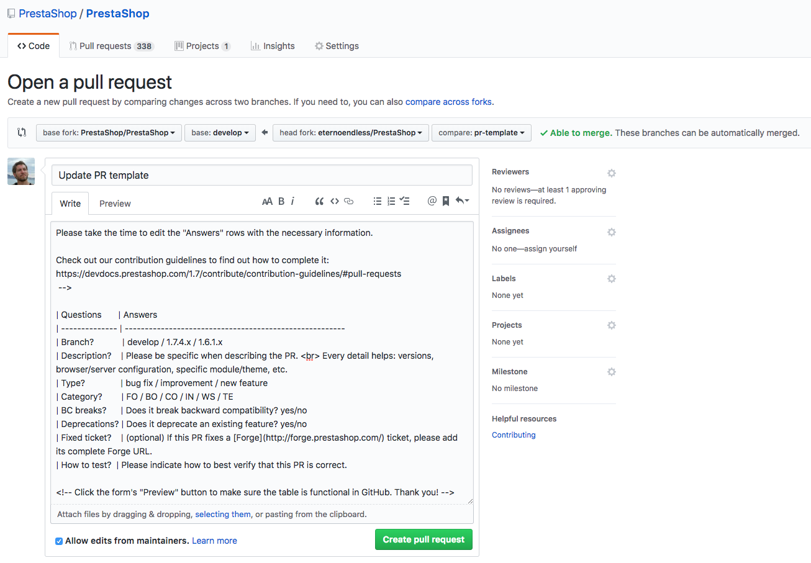

# Contribution guidelines

Ready to contribute code? Here's what you need to know to get your Pull Request accepted.

The PrestaShop project receives dozens of contributions every week, and every single one of them is reviewed by project maintainers. The review process ensures that only changes that meet a certain quality standard are merged in the codebase. 

Please note that the following guidelines apply to all contributions to the project, and not following them may lead to your contribution being rejected.

## Commits

### Atomic commits

We consider a good practice to make **atomic commits**, meaning that each commit's purpose is **one, and only one, complete fix or change**. Typically, ask yourself if what you are doing is one or several tasks. 

Atomic commits make review easier, and it also helps for cherry-picking or reverting changes (we hope to never have to do that 😉).

{}
Do not hesitate to use [interactive staging](https://git-scm.com/book/en/v2/Git-Tools-Interactive-Staging) if you have made several changes in the same file but not all those changes are meant to be in a single commit.
{}

### Writing a good commit message

The commit name should give an idea of the nature and context of the change that has been done. The more details, the better! The commit name should be as unique and recognizable as your commit itself. There are multitude of articles on the web regarding commit messages, here are two that you can find useful:

- [How to Write a Git Commit Message](https://chris.beams.io/posts/git-commit/)
- [What makes a good commit message?](https://hackernoon.com/what-makes-a-good-commit-message-995d23687ad)

#### Bad examples

Bad commit messages give pretty much no context:

- `add cli new`
- `fix useless code`
- `fix code review comments`

#### Good example

A good commit message explains _what_ is done, and _why_: 
```text
Make Source.indexOf(ByteString) significantly faster

Previously the algorithm that did this was extremely inefficient, and
had worst case runtime of O(N * S * S) for N is size of the bytestring
and S is the number of segments.

The new code runs in O(N * S). It accomplishes this by not starting
each search at the first segment, which could occur many times when
called by RealBufferedSource.
```

{}
Some tips:

- Separate subject from body with a blank line
- Limit the subject line to 50 characters
- Capitalize the subject line
- Use the body to explain _what_ and _why_ vs. _how_
{}

### Compiled assets

{}
Assets no longer need to be compiled in the develop branch. More information in [this article](https://build.prestashop.com/news/open-question-not-commiting-assets-anymore/).
{}

Some source files like SCSS and JavaScript need to be compiled to work on a PrestaShop shop. To ease up the life of contributors who don't want to fuzz around installing node and NPM, we require those files to be compiled and committed in the same Pull Request as the source changes.

Make sure to follow these guidelines:

- **Compile assets for production.** Check that that the assets you are compiled were built using the "prod" setting instead of the "dev" one. To find out more, read [How to compile assets][how-to-compile-assets].
- **Commit assets and sources separately.** Submit your compiled assets in a separate commit from your source changes. This will be especially helpful when rebasing, because you can just drop the commit and avoid merge conflicts.
- **One asset commit per Pull Request**. Try to avoid recompiling and committing the assets more than once. If you need to make changes and you have already committed a previous build, use interactive rebase to remove the previous commit, _then_ compile the assets. 


## Pull Requests

Changes submitted through your Pull Request will be reviewed by PrestaShop maintainers. The code review process is generally regarded as a good practice and adopted by hundreds of software projects around the world. It provides lot of benefits:

- **it helps spotting errors in the code**, because we all make mistakes and it's very hard to find one's own mistakes.
- **it helps improving code quality** not only by ensuring it's readable and understandable, but also by pinpointing design, performance or security issues that may have been unintentionally introduced by the author.
- **it helps spread knowledge of the code base**, because the reviewer will learn how your code works too.

And don't forget that reviewing is a discussion, not a to-do list: the goal is to find the best solution by sharing different points of view.

However, reviewing code is hard and can be exhausting. Making your pull request as easy to review as possible will help in getting it accepted swiftly. Completing the pull request form (explained below) properly, explaining the reasons behind some of your technical choices as well as any part of the code that could be tricky to understand... those are some examples of things that you can do to help ease up the process.

Also, please avoid submitting very large PRs when it can be avoided.

- If you modified a lot of files or a very big number of lines, it is unlikely that you're addressing a single issue: please try and submit one PR for each issue you solve. This way, a problem in one change won't block other valid changes from being merged.
- A PR with a lot of changed lines will take a long time to review, and consequently the reviewer might miss possible issues. If your PR is too big, it may be rejected due to risk of regressions.
- The longer it takes to merge a PR, the more it is likely that it will be blocked by merge conflicts. Whenever a Pull Request is rebased, it has to be reviewed again, thus increasing the time to merge, thus increasing the risk of conflicts...

Remember: **smaller changes are easier to review, easier to test and easier to merge.**

### The Pull Request form

When you create a new Pull Request, you will be presented with a form to complete that looks like this:



The first step is to write a summary of your pull request's purpose in its GitHub title. A summary does not mean it can not be explicit. Please describe what your pull request does in detail (avoid "Fix product page" or "Category page improvement").

{}
Writing a good Pull request title is important as this the only thing that people will see in the Change log.
{}

Then, proceed to complete the Pull Request table. This step is vital for:

- Making sure the branch your PR targets is the one that you meant
- Understanding your change
- Making sure that it works as expected
- Tracking when a PR fixes a known issue
- Tracking if a change introduces affects backwards compatibility (BC breaks)
- Building the change log (changes are grouped by type and category).

#### Target branch

Pull requests must be made in the appropriate branch, depending on the nature of your change.

* **Develop**. New features, bug fixes, improvements. PRs merged here will be released in the next minor or major version.
* **Patch version branch** (eg. 1.7.4.x). For critical bug fixes and regressions only. PRs merged here will be released in a patch version. 

{}

##### About supported branches

PrestaShop only accepts PRs on branches which are subject to new releases.

Once PrestaShop releases a new minor ("dot-zero") version, it won't release new patch versions for previous minor versions – with the exception of rare cases, for example if a security bug is found just before or after a minor release is published.

This means that only the latest minor version patch branch is supported.

For example, the `1.7.4.x` branch is supported until the release of version 1.7.5.0. After that, the only supported version branch will be `1.7.5.x`, and so on.

If you find a bug on an unsupported version, make sure that bug is still present in the latest version. If the bug is still present, please submit a PR on `develop`.

**PRs on unsupported versions will be closed.**

{}
When in doubt, use the develop branch. We will ask you to rebase on the correct branch if necessary.
{}
{}

#### Category

The category is the portion of the project to which your changes apply to. We use this code to construct the [change log](https://github.com/PrestaShop/PrestaShop/blob/develop/docs/CHANGELOG.txt) by grouping changes in different sections. Choose the code that most closely describes your change:

Code | Scope
-----|------
FO | if the changes impact the Front Office
BO | if the changes impact the Back Office
IN | if the changes impact the Installer
WS | if the changes impact the Web Services
CO | if the changes impact the Core (non-visible functionality)
LO | if the changes impact localization functionality
TE | if the changes impact automated tests
ME | if the changes only import a git branch into another (eg. merge maintenance branch into develop)
PM | if the changes are related to project management (eg. edit Github pull request form)

{}
Remember, this is only needed for the Pull Request form, not for your commit messages.
{} 

[how-to-compile-assets]: {}


## Dependencies

Adding third party software in the core or in a module might sometimes be faster and easier than to develop it from scratch and then to maintain it. Composer and NPM are used to manage such dependencies in the PrestaShop open source project.

It is possible to add new dependencies, after a careful selection and study. A few rules must be followed.

### Licenses

The first step is to check the **legal compliance** of a third party software. The PrestaShop open source project being written and distributed under the OSL license, aggregated dependencies must be compatible with it. 

Below is a list of the known compatible licenses that can accepted for software:

- MIT
- ISC
- BSD
- AFL
- EUPL
- Apache
- CC-O
- Unlicense

Additionally, artwork (e.g: icons, pictures, fonts, but not only) is usually distributed with specific licenses. Below is a list of known compatible licenses that can be accepted for artwork:

- CC-0
- CC-by-sa
- CC-by
- Art Libre
- Artistic
- Unlicense

In general, public domain is not acceptable, as it doesn't exist in all juridictions or countries.

If the proposed dependency is available with a compliant license, a last check is done to be sure that there is no additional clause that would introduce a restriction of use.

If the legal compliance is confirmed, it will be possible to go the next step: the technical review.


## Read more

- [What happens after you submit a contribution]()
{}


