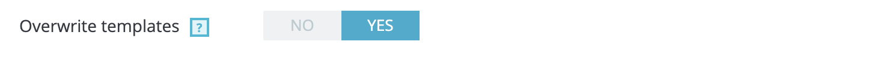

# The Email Theme component


## Introduction

Up until now PrestaShop used static templates to manage its emails. These templates had to be created for each
language and were downloaded on language installation and stored in the `mails` folder.

This had a few drawbacks, you needed to download email packs each time you were installing a new language,
and if the language has not been managed you often end up with emails in english. This gets even more complicated when you
use an email theme which is therefore limited to the languages it was able to create.

That's why we started a large refacto of this email feature, to avoid having too many breacking changes we still rely
on static email templates, which are used by the `Mail::send` method, however these templates are now dynamically generated
each time you install a new language. This is the first step to improving emailing in PrestaShop, as the feature gets developed
further we will add more advanced customization in email templates.

### Vocabulary

As terms like layouts, templates and so can be confusing we are going to clarify them in this page to be sure you know what we are referring to:

* **layouts** are the files that will be **rendered** by Twig they can use logic statements, translation tools, extend other base layouts or include components, ... They are the basic files that compose your email theme and are located in the folders `mails/themes/classic`, `mails/themes/modern`, ...
* **templates** are the static files (html or txt) that will be **generated** by our `MailThemeGenerator`, they contain no logic and are translated for **ONE** language. They are the files used by the `Mail` class when you send a mail and are located in the folders `mails/en`, `mails/fr`, ...

## Architecture

### Folder structure

The new email themes layout files are stored in the `mails/themes` folder, the `1.7.6` version comes with two email themes:

* **classic** (the legacy email theme that was integrated with PrestaShop up until the 1.7.6 version)
* **modern** (a new email theme with a more modern and more responsive design)

Each of these folder contains twig layouts which are organized in a conventional way:

```bash
...
├── mails
|   ├── themes
|   |   ├── modern
|   |   |   ├── assets # Contains the assets used in your layouts (optional)
|   |   |   ├── components # Contains block parts or base layouts for your email theme (optional)
|   |   |   |   ├── footer.html.twig
|   |   |   |   ├── layout.html.twig
|   |   |   ├── core # Contains layouts for Core transactional mails
|   |   |   |   ├── account.html.twig # HTML layout for "account" transactional mail
|   |   |   |   ├── account.txt.twig # TXT layout for "account" transactional mail
|   |   |   |   ├── bankwire.html.twig # HTML layout for "account" transactional mail
|   |   |   |   ├── cheque.txt.twig # TXT layout for "account" transactional mail
|   |   |   |   ├── contact.html.twig # TXT layout for "account" transactional mail
|   |   |   ├── modules
|   |   |   |   ├── followup # Module's name
|   |   |   |   |   ├── followup_1.html.twig
|   |   |   |   |   ├── followup_2.html.twig
|   |   |   |   ├── ps_emailalerts # Module's name
|   |   |   |   |   ├── new_order.html.twig
|   |   |   |   |   ├── followup_2.html.twig
...
```

As you can see there are two types of layouts (and similarly templates), **HTML** layouts (which can contain tags for attractive design, images, links, ...)
and **TXT** which only contain raw text, used for old email browsers or non interactive environment. The name of our layouts use the following convention:
`{layout_name}.{layout_type}.twig`, for example:

* `account.html.twig` : layout for the `account` mail with `html` type
* `cheque.txt.twig` : layout for the `cheque` mail with `txt` type

As you may have noticed, some of our layouts have both types (e.g.: `account`) whereas others only have html or txt type (`banwire`, `cheque`, ...).
This is because you are not forced to define both types as they will be used as a fallback for each other:

* if you only have the **html** type, the same layout will be stripped and the raw text will be used as your **txt** layout
* if you only have the **txt** type, the same layout will be used for **html** layout (and you won't have images or other rich elements)

{}
As a consequence of this fallback system, and since we mostly want rich HTML emails, most email themes will only contain html layouts and txt ones
will be automatically generated from them.
{}

### Workflow

The workflow to generate is a bit complex, it has been divided into multiple classes to separate each operation which simplifies testing and code understanding.

* **GenerateThemeMailTemplatesCommand** is the starting point that launches the email generation, it is merely a container of the generation settings
* **GenerateThemeMailTemplatesCommandHandler** is the command bus handler in charge of executing the generation
* **FolderThemeCatalog** is the class in charge of scanning the themes from folder structure it returns a type `ThemeCollection`
* **MailTemplateGenerator** is the class driving the generation of a `ThemeInterface` for the requested `LanguageInterface`
* **MailTemplateTwigRenderer** is the component which actually renders the layout, based on the Twig renderer, it also applies some `TransformationInterface` afterwards
* **LayoutVariablesBuilder** is in charge of building the variables that will be used by the twig layouts



> You can update this schema using the [source XML file](/schemas/1.7/email_generation_workflow.xml) importable in services like [draw.io](https://draw.io).

### Available hooks

As you can see in the workflow a few hooks are available in the email generation for you include your own themes, layouts, variables, transformations, ...

* **actionGetMailThemeFolder** allows you to override a mail theme folder (`mails/theme/{themeName}`)
* **actionListMailThemes** allows you to modify the `ThemeCollection` (add, remove, modify a theme or its layouts)
* **actionBuildMailLayoutVariables** allows you to modify the variables of a specific layout
* **actionGetMailLayoutTransformations** allows you to modify the transformations applied to a specific layout

### Template variables

{}
**Layout variables are NOT template variables**

Always keep in mind that the variables used by the `LayoutVariablesBuilder` will be used during template generation, meaning they will only be used
when static templates are exported and won't be able to change when you send your emails. Do not mix them up with template variables (like firstname,
lastname, ...) which are replaced at the last moment when the email is sent by the `Mail::send` function.
{}

Here is a quick resume of the differences:

|               | Layout                    | Template                         |
| ------------- |:------------------------- |:-------------------------------- |
| Renderer      | Twig                      | Swift_Plugins_DecoratorPlugin    |
| Syntax        | `{{ variable }}`          | `{ variable }`                   |
| Interpreted   | On generation             | On sending                       |
| Target        | All users/customers       | Specific user/action             |
| Use cases     | Design, translations, ... | Customization (user, order, ...) |

{}
On the same principle, you can add twig logic in your templates (like conditions on email types, or why not your own
layout variables to deal with customization) but it will only be useful during email generation. So don't use any twig
logic to adapt the templates for your user or an order.
{}

## Translation

One of the main advantages of the email generation is the possibility to use translations in the layouts, here is an example:

```twig
  <table width="100%">
    <tr>
      <td align="center" class="titleblock">
        <font size="2" face="Open-sans, sans-serif" color="#555454">
          <span class="title">{{ 'This is a translated string'|trans({}, 'EmailsBody', locale)|raw }}</span>
        </font>
      </td>
    </tr>
  </table>
```

## Automatic generation

So now that you know how the generation process works, you might wonder **when** exactly does it happen? There are a few cases when generation is **automatic**:

* In `Language` class and more particularly during the calls to `Language::downloadAndInstallLanguagePack`, `Language::installLanguagePack` and of course `Language::installEmailsLanguagePack` which is now **deprecated**
* In `PrestaShopBundle\Install\Upgrade::run` when languages are updated

## Manual generation

Of course sometimes you still want to manually generate your emails (new theme installed, changes in some layouts, ...), then you can use:

* In the Symfony command `prestashop:mail:generate` if you want to launch a CLI generation
* In the "Design > Email Theme" page when you use the form to launch the generation manually (once per language)

## Choosing my default theme

Your shop can only use one theme at a time, so if you go to the "Design > Email Theme" page you will be able to choose your default email theme.
This default theme will be used each time the generation process is launched automatically (language installation, upgrade, ...).

The default theme starting from `1.7.6` will be the **modern** theme, the *classic* theme was provided for backward compatibility and as an example.

{}
**I changed my default theme but my emails didn't change.**
Indeed when you select your default theme you simply update your configuration, so any **future** generation will use the theme you selected.

However no generation process is launched when you select a theme, so if you want to generate your emails with your newly selected theme you need to do it manually thanks to the "Generate emails" form.
/!\ The form only generates **one** language so you will have to repeat the action for each Language installed on your shop.
{}

{}
**I tried to generate emails of a new theme but my templates are still in the former one.**

Two possibilities for this issue:

* As you may have noticed the `GenerateThemeMailTemplatesCommand` and the "Generate emails" form have an **overwrite** option. We need this option because some shops
may have installed email themes, or customized their templates manually. For that reason by default the generation process **does not** export a template when it **already exists**.
If you want to erase the former templates you need to enable the `overwrite` option, be careful this will replace **all** existing templates you can't choose which ones.



* As you may know email templates can be integrated in your PrestaShop theme (and I mean here the **shop theme** not the email theme). In which case they are no longer contained in
the default `mails` folder but instead in `themes/{my_theme}/mails/...` folders, and they override the default ones. So even if you generate your new theme (both automatically and manually)
the templates contained in the theme will have the priority. So you need to generate your theme manually and to select the shop theme you want to overwrite, then the templates will be
generated in its folder and will be used from now (don't forget to enable the `overwrite` option if you want to replace them).


{}

## Learn more

### Reference

* Here is an [example module](https://github.com/jolelievre/example_module_mailtheme) showing how to integrate with the email generation workflow

### Tutorials

* [How to add a layout in a theme from my module?](./tutorials/add-a-layout-from-module)
* [How to add layout variables from my module?](./tutorials/add-layout-variables-from-module)
* [How to add a transformation from my module?](./tutorials/add-transformation-from-module)
